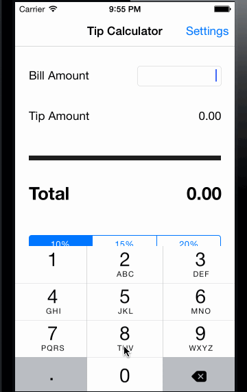

# iOS-tipCalculator

This is an iOS demo application for calculating the tip and the total amount for any bill. 

Time spent: 8 hours spent in total.

Completed user stories:

 * [x] Required: Added the Settings page to the Tip Calculator app.
 * [x] Required: Persisted the settings over app starts. 
 * [x] Required: Updated the views after settings were changed.
 * [x] Optional: Added a round-off total amount preference to the settings.
 * [x] Optional: If round total preference is set, tip is adjusted and "(After adjustment)" text is shown below "Tip Amount"
 
Notes:

The round off is closest to the 0.5 dollar amount. For example, $15.4 total amount will be rounded to $15.5

Walkthrough of all user stories:

GIF created with [LiceCap](http://www.cockos.com/licecap/).
